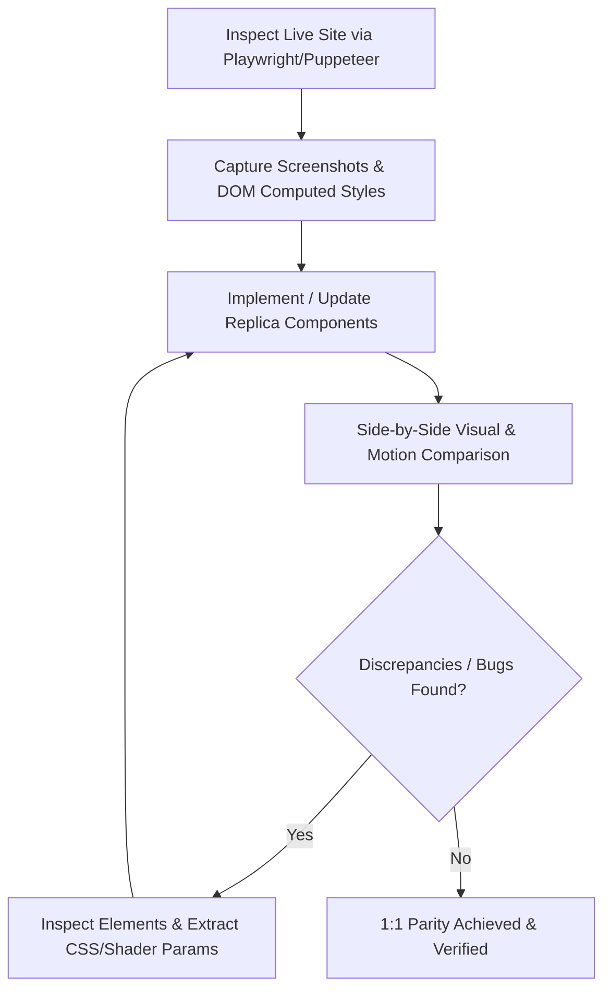

# 1:1 Website Replica Specification: Matt Jinn (`https://mattjinn.com/`)

## 1. Core Objective & Essence

The goal of this project is to build an **uncompromising, 1:1 pixel-perfect and motion-perfect replica** of [https://mattjinn.com/](https://mattjinn.com/) across all viewpoints, interactions, and breakpoints. 

Every single visual and interactive detail must mirror the original site:
- **Visual Identity & Aesthetics**: Exact typography hierarchies, contrast ratios, color schemes, padding/margins, and component alignments.
- **Motion & Shader Fidelity**: WebGL displacement shaders, fluid canvas transitions, GSAP scroll triggers, cursor tracking, and staggered typography animations must match the original down to easing curves and frame timings.
- **Responsiveness**: Flawless behavior and layout parity on Mobile, Tablet, Laptop, and Ultra-Wide Desktop screens.

---

## 2. Key Pages & Routes to Replicate

| Route | Page / State | Key Features & Elements |
| :--- | :--- | :--- |
| `/` | **Home / Landing** | WebGL displacement hero banner, interactive cursor, subtle grain overlays, minimal navigation bar, dynamic project/audio showcase. |
| `/shows/` | **Shows & Tour Dates** | Editorial tour date list, interactive hover states with dynamic backdrop image reveals, ticket CTAs. |
| `/about/` | **Editorial About** | Asymmetric high-fashion editorial layout, biography typography, subtle scroll parallax, inline imagery. |
| `/videos/` | **Videos & Media Gallery** | 16:9 cinematic video reel grid, custom modal / video player integration, sound toggles, hover zoom effects. |
| *Global* | **Fullscreen Navigation Overlay** | Kinetic menu opening animation, staggered menu item entry, full-viewport backdrop blur/distortion. |
| *Global* | **Loader & Page Transitions** | Minimalist initial preloader, seamless WebGL canvas displacement transitions between subpages. |

---

## 3. Motion & Animation Engineering Standards

Animations are the defining essence of this website. Approximations or generic transitions are strictly prohibited.

### A. WebGL & Shader Distortion
- Replicate the exact WebGL displacement distortion / liquid ripple transition on image hovers and page transitions.
- Maintain consistent shader vertex/fragment passes, texture noise maps, and easing durations.

### B. GSAP & Kinetic Typography
- **Scroll Triggers**: Exact scroll-jacking/scrubbing curves, pinned sections, and scroll-linked progress indicators.
- **Text Entry / Reveals**: Line-by-line or character-by-character mask clip-path reveals with matching cubic-bezier easing.
- **Cursor Tracking**: Custom magnetic cursor with inertia smoothing and hover-state expansion.

---

## 4. Verification & Bug-Fixing Protocol via Playwright / Puppeteer MCP

To ensure absolute 1:1 fidelity, all visual components and motion sequences must be rigorously compared and validated using **Playwright** and **Puppeteer** MCP tools.

### Verification Workflow:
1. **Live Inspection**:
   - Use `browser_navigate` or `puppeteer_navigate` to open `https://mattjinn.com/`.
   - Inspect computed styles, animation keyframes, bounding box coordinates, font metrics, and canvas shaders via `browser_evaluate` / `puppeteer_evaluate`.
2. **Visual & Layout Auditing**:
   - Capture full-page and element-specific snapshots (`puppeteer_screenshot` / `browser_take_screenshot`).
   - Compare local dev builds against live screenshots at identical viewport dimensions (`1920x1080`, `1440x900`, `768x1024`, `390x844`).
3. **Motion & Interaction Testing**:
   - Simulate clicks, hovers, scroll sequences, and page navigations (`browser_click`, `browser_hover`, `browser_press_key`).
   - Measure animation timing, FPS smoothness, and transition transitions to eliminate lag or layout shift.
4. **Bug Diagnosis & Resolution**:
   - Extract exact DOM structures and CSS values directly from the browser instance to resolve layout offsets, clipping issues, or typography mismatch.

---

## 5. Technical Stack Guidelines

- **Structure**: Semantic HTML5 / Next.js / Vite.
- **Styling**: Vanilla CSS / CSS Modules with CSS custom properties matching the design system tokens.
- **Animation & Shaders**: GSAP (ScrollTrigger, Flip, SplitText) + Three.js / OGL / WebGL canvas shaders.
- **Testing & QA**: Playwright MCP & Puppeteer MCP.
